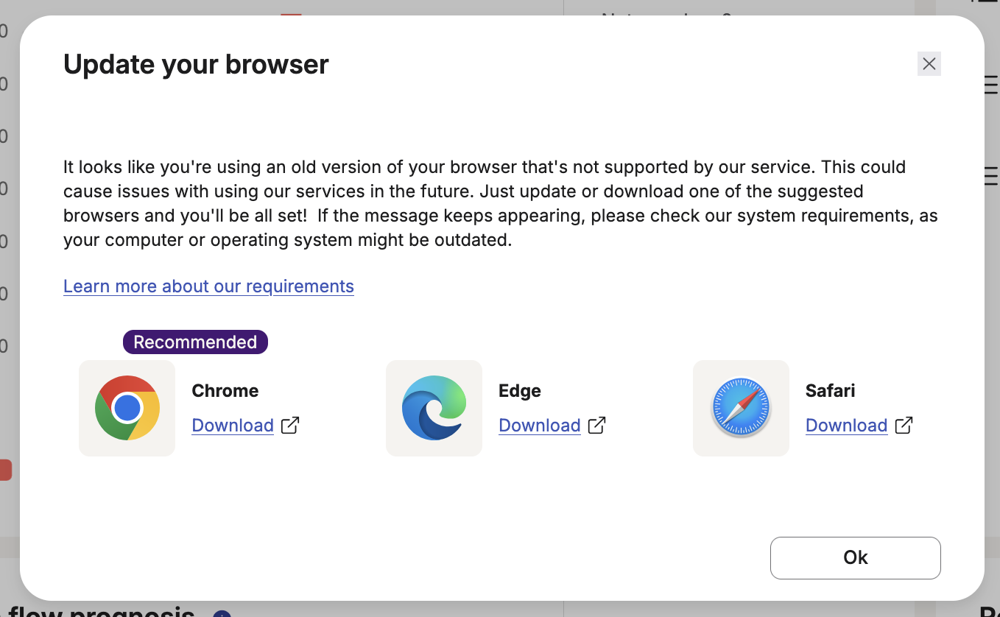

Visma eAccounting displays a pesky popup on every page load on their site when using Firefox.

This hides it.

https://eaccounting.vismaonline.com/

I opened case #00347823 at https://hjelp.eaccounting.no.

Submitted at https://addons.mozilla.org/en-US/firefox/addon/eaccounting-hide-browser-updat/